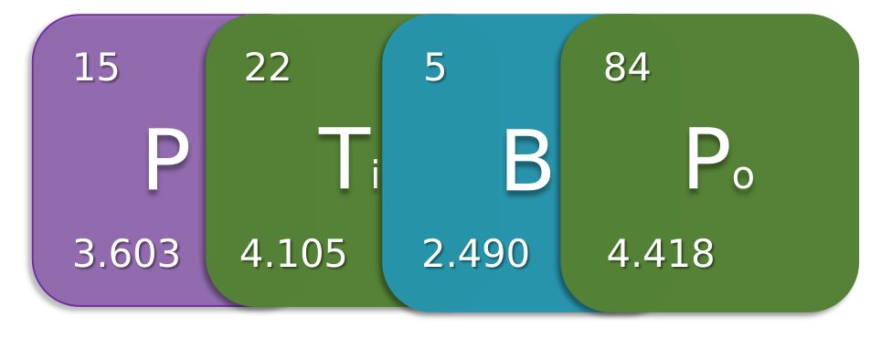
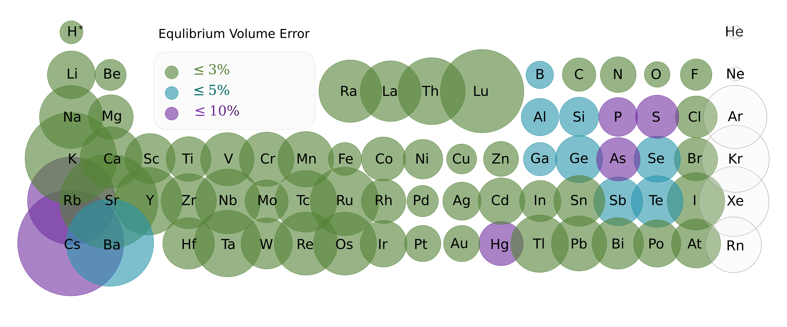

# The code for Density functional Tight-binding theory Parameterization: Periodic table baseline parameter set (PTBP)

<div align="center">

</div>

What does it include?
#### 1. Quick SKF file generator

<div style="background-color:#F8D7DA; padding:10px">
<strong>Tip:</strong>
SKF(Slater-Koster file) includes integral tables describing the Hamitonian and overlap matrix elements on an equidistant grid, where Hyperparmeters for confinement potential were embeded with the way of confinement pseudo-atomic orbitals.
</div>

For detail format of SKF, reference to [SlaterKosterFiles][1].
- [x] Generate skf files based on exists parameters (eg. [QUASINANO][2], [PTBP][3])
- [x] Generate skf files with your own parameters
- [x] Upload skf files to [https://zenodo.org/doi/10.5281/zenodo.10677795] [6]

#### 2. Parameterization (atomwise, comparing to pairwise)
- [x] Optimize parameters based on Loss: Energy & Geometry(the repetition of Paper [PTBP][3])
- [x] Optimize parameters based on Loss: Band structure (should be carefull to align the bands between DFTB and DFT `utils/calculator.py-delta_band_binary()`)
- [x] Optimize parameters based on Loss: Energy & Forces with datasets


## Installation

```bash
# In your conda env (e.g. `mpvasp`):

# 1. libxc C library + Python bindings — install from conda-forge.
#    `pip install pylibxc` alone fails because the underlying C lib is missing.
mamba install -c conda-forge libxc pylibxc

# 2. hotcent — not on PyPI, install editable from GitLab source.
#    Requires a C compiler (the package builds a small C extension `_hotcent`).
git clone https://gitlab.com/mvdb/hotcent
cd hotcent && pip install -e .

# 3. (Optional, only for --optimization_option) DFTB+ binary.
#    Pin to the nompi build to avoid pulling mpich/scalapack as dependencies.
mamba install -c conda-forge "dftbplus=25.1=nompi_*"

# 4. PTBP itself — installs `ase`, `scikit-optimize`, etc., and registers a
#    `ptbp` console-script entry point. Run from the repo root (i.e. ptbp_lab/).
pip install -e .
```

Verified working combination (May 2026, macOS arm64, Python 3.11):
`ase 3.28.0`, `scikit-optimize 0.10.2`, `pylibxc 7.0.0`, `hotcent 2.0.1`,
`dftbplus 25.1` (nompi).

### Notes

- **`utils/_compat.py`** is loaded automatically on first import of `utils.*`
  or `cli.*`. It applies two compatibility shims at runtime:
  (a) forces `multiprocessing` to use the `fork` start method on macOS so the
  internal `mp.Pool` calls in `utils/hotpy.py` and `utils/loss.py` do not hang
  silently under `spawn`; (b) papers over the ASE 3.20+ extxyz refactor so
  `atoms.info['energy']` and `atoms.get_array('forces')` keep working on
  files written by the new ASE.
- **DFTB+ is only required for `--optimization_option`** (energygeometry /
  bandstructure / dataset / reaction). The `--skf_generator` paths only need
  hotcent + physrep + pylibxc.

### Quick smoke test (no DFTB+ needed)

```bash
mkdir -p /tmp/ptbp_test && cd /tmp/ptbp_test
ptbp --skf_generator full --symbols H O --known_parameters PTBP
# Generates H-H.skf, H-O.skf, O-H.skf, O-O.skf in the cwd.
```

---

## Quick start

After `pip install -e .`, the toolkit exposes four subcommands via the
`ptbp` console script:

```bash
ptbp setup                                  # Interactive TUI wizard (start here if unsure)
ptbp gen H O                                # Generate H/O Slater-Koster files
ptbp optimize my_data.xyz                   # Auto-detect mode + run BO
ptbp postprocess run_2026-05-05_22-30/      # Re-emit plots from a prior run
```

Don't know what flags or values to pass? Run `ptbp setup` — it walks
you through dataset selection, validates the file (formula count,
energy/force presence, auto-detected mode), and lets you pick the
optimiser / E0s / advanced knobs through a multi-step terminal wizard
(works over plain SSH, no X-forwarding required). At the end it writes
a reproducible `ptbp_run.yaml` and prints the equivalent
`ptbp optimize ...` command for you to run in your shell / tmux / SLURM.

Each subcommand has its own focused `--help`. Common one-liners:

```bash
# Generate SKFs for a list of elements using PTBP-published params
ptbp gen H O Cu --params PTBP

# Optimize on a flat dataset of structures-with-energies-and-forces.
# Auto-fits per-element E0s on first run, caches them, auto-detects the
# optimisation mode from the dataset shape, writes everything into
# ./run_<UTC-timestamp>/.
ptbp optimize trajectory.xyz

# Force a particular mode and use particle swarm
ptbp optimize trajectory.xyz --mode reaction --optimizer pso --n-particles 4 --n-calls 24

# Run from a YAML config, override one field on the CLI
ptbp optimize trajectory.xyz --config myrun.yaml --n-calls 30

# Re-do plotting / packaging from a finished run without rerunning the
# optimiser (reads <run_dir>/result.pkl + <run_dir>/ptbp_run.yaml)
ptbp postprocess run_2026-05-05_22-30/
```

`ptbp` also still accepts the original flat CLI (`--skf_generator ...` /
`--optimization_option ...`) — see the Legacy CLI appendix at the bottom.

---

## 1. SKF file generator

The skf_generator based on [Hotcent][4] and [Libxc][7] for bandstructure(H/S) part generation, and [Phyrep][5] for repulsive part generation.

[1]: https://dftb.org/fileadmin/DFTB/public/misc/slakoformat.pdf "Format of the v1.0 Slater-Koster files"
[2]: https://doi.org/10.1021/ct4004959 "DFTB Parameters for the Periodic Table: Part 1, Electronic Structure"
[3]: https://doi.org/10.1021/acs.jctc.4c00228 "Obtaining Robust Density Functional Tight Binding Parameters for Solids Across the Periodic Table"
[4]: https://gitlab.com/mvdb/hotcent "Hotcent Gitlab page"
[5]: https://gitlab.com/jmargraf/physrep "Physrep Gitlab page"
[6]: https://zenodo.org/records/10677796 "ParameterSets file"
[7]: https://www.tddft.org/programs/libxc/ "Libxc"
[8]: https://mncui.gitlab.io/mbook "mbook"


### 1. Generate from a published parameter set

```bash
ptbp gen C H O Cu --params PTBP
```

Equivalent legacy CLI (still supported):
```
python cli/run.py
--symbols C H O Cu
--skf_generator full
--known_parameters PTBP
```
- `--symbols`: for symbols
- `--skf_generator`: option for generating the `full` (bandenergy part + repulsive part), or only `band` or `rep` part.
- `--known_parameters`: option for generating parameters based on known_parameters `PTBP`, `QNplusRep` or `Prior`.
> `PTBP`: the general parameter set was shown in [PTBP][3] that aims to give robust description for solid states.

> `QNplusRep`: the parameter sets combined band energy part from [`QUASINANO2013`][2] and repulsive part that optimized in the same way as `PTBP`.

> `Prior`: use the empirical way to define the cutoff parameters with `r0_w=2*r_cov` and `r0_d=4*r_cov`, where `r_cov` means the covalent raduis, plus the repulsive part that optimized in the same way as `PTBP`.

> One can found the pre-generated SKF files correspondingly over [zendono][6]


### 2. One wants to generate skf files based on their own parameters
```
python cli/run.py 
--symbols C H O Cu 
--skf_generator full 
--confinement_parameters 3.0 5.0 2.0 3.0 5.0 2.0 3.0 5.0 2.0 3.0 5.0 2.0 
--repulsive_parameters 0.6 0.0 0.6 0.0 0.6 0.0 0.6 0.0
```
- `--confinement_parameters`: defines `r0_w`, `r0_d` and `p` values, respectively. In this example we simply assign same parameters (3.0, 5.0, 2.0) for each elements.

$$V_{conf} = \left( \frac{r_{cov}}{r^0} \right)^p$$
- `--repulsive_parameters`:defines `sigma_rep` and `kxc`, in this example we also simply assign same parameters (0.6, 0.0) for each elements. `kxc` was set to 0.0 defaultly in [PTBP][3], becuase it does not obviously affect the performance on Loss: Energy & Gemetries but burden the optimization process so much.


## 2. Parameterization
#### 1. Elementary

<strong>Tip:</strong>
Please check this [MBOOK][8] for the detail performance of each element!
</div>


Necessary preparations
- folders that contain the reference xyz file from DFT
- the arguments can be found in `cli/arg_parser.py`


```
ptbp --ref_dir dft \
    --results_dir   results \
    --dft_file      dft.xyz \
    --eos_file      fit.json \
    --eos_points    11 \
    --log_file      log.out \
    --para_file     par.out \
    --optimization_option   energygeometry \
    --parameters    r0_w r0_d sigma_rep \
    --superposition density                \
    --checkpoint    checkpoint.pkl \
    --xc            GGA_X_PBE+GGA_C_PBE \
    --kpt_density   5.0
```

- Where `dft` folder includes the reference file: `dft.xyz`, `fit.json`(which contains the Equation of state fitting results of reference dft), one can find the examples for `Cu` inside the dft folder.
- The parameters of each optimization step are stored inside `par.out`.
- `optimization_option`: defines different target loss. The four supported modes are documented below.
- `parameters`: specifies which parameter will be optimized, we use `r0_w, r0_d` and `sigma_rep` in our work.
- `xc`: defines the exchange correlation
- `kpt_density`: for DFTB calculation

### 3. Optimization modes

The same outer Bayesian optimisation loop drives every mode; what changes is
the loss function inside the inner `Repulsion_optimization` step.

| `--optimization_option` | Input shape | Loss | Required extras |
|---|---|---|---|
| `energygeometry` | An EOS scan of N phases × `--eos_points` volumes (i.e. `--eos_points 11` strict). | μ_E + μ_V + μ_B (Boltzmann-weighted EOS fit; matches the original PTBP paper). | `--eos_file fit.json` (DFT EOS results) |
| `dataset` | Any ASE-readable trajectory (xyz, traj, …) of structures with DFT energies + forces. | (1−c)·μ_E + c·μ_F over all structures (per-atom formation energy + force MAE). | `--E0s '{"<Z>": <eV>, ...}'` (atomic ref energies as JSON dict) |
| `reaction` | Same as `dataset`, but the trajectory is expected to span multiple chemical formulas. | Identical to `dataset` plus a `reaction_per_formula.csv` written next to `par.out` reporting per-formula mean / max ΔE per atom. | `--E0s` (same as dataset) |
| `bandstructure` | A k-path band-structure reference. | HOMO/LUMO mismatch. | `--dft_band_file dft.json` |

#### Examples

```bash
# EOS mode (the original PTBP workflow):
ptbp --ref_dir dft --dft_file dft.xyz --eos_file fit.json --eos_points 11 \
     --optimization_option energygeometry \
     --parameters r0_w r0_d sigma_rep --superposition density

# Dataset mode (energy + forces on any trajectory):
ptbp --ref_dir dft --dft_file my_data.xyz \
     --optimization_option dataset \
     --parameters r0_w r0_d sigma_rep --superposition density \
     --E0s '{"6": -37.8, "1": -0.5}'

# Reaction mode (multi-formula dataset; same loss + per-formula breakdown):
ptbp --ref_dir dft --dft_file mixed_formulas.xyz \
     --optimization_option reaction \
     --parameters r0_w r0_d sigma_rep --superposition density \
     --E0s '{"6": -37.8, "1": -0.5, "8": -75.0}'
```

`--E0s` accepts a JSON dict keyed by atomic number; in `dataset` / `reaction`
mode the formation energy of each structure is computed as
`E_struct − Σ_Z E0[Z] · n_Z`, then aggregated into the loss.

#### Auto-fit E0s with on-disk cache

If you omit `--E0s` in `dataset` / `reaction` mode, PTBP first looks for a
cached fit at `<ref_dir>/E0s_dft.json`; if missing, it least-squares-fits
per-element E0s from the dataset's own `info['energy']` values
(solving E_total ≈ Σ_Z N_Z · E0[Z] across all structures) and writes the
result to that path. Subsequent runs reuse the cache for free, so the
typical workflow becomes:

```bash
# First run (no --E0s): auto-fit + cache
ptbp --ref_dir dft --dft_file my_data.xyz --optimization_option dataset \
     --parameters r0_w r0_d sigma_rep --superposition density

# Second run: cache hit, no refit
ptbp --ref_dir dft --dft_file my_data.xyz --optimization_option dataset \
     --parameters r0_w r0_d sigma_rep --superposition density
```

The fitted E0s are *self-consistent with the dataset* (the constant offset
cancels out of formation energies) but are not "true" isolated-atom
energies. If your dataset is dominated by one composition the fit is
ill-conditioned — you'll see a `WARNING: design matrix rank-deficient`
log line and should pass `--E0s` explicitly.

#### Other knobs

- `--n_calls N` — total Bayesian-optimisation iterations
  (defaults: 11 for energygeometry/dataset/reaction, 100 for bandstructure).
  In resume mode (see below) this is the number of *additional* iterations.
- **Smart BO seed**. When the dataset is a single element that has an
  entry in `utils.parameters_set.get_PTBP()`, PTBP starts the BO from
  the published `(r0_w, r0_d)` for that element instead of the
  `(3·r_cov, 5·r_cov)` heuristic. You'll see
  `BO seed from PTBP[<element>]: r0_w=..., r0_d=...` in the log.
  Multi-element datasets fall through to the heuristic seed.
- **Resume from checkpoint.** PTBP writes `checkpoint.pkl` (skopt
  `OptimizeResult` snapshot) after every BO iteration. On rerun in the
  same cwd, the file is automatically loaded:

  ```
  [checkpoint] Resuming from checkpoint.pkl: 11 prior iteration(s)
                loaded; will run 5 more (total stored: 16).
  ```

  Pass `--n_calls` to control how many additional iterations to run on
  top of what's stored. To force a cold start, delete `checkpoint.pkl`.

### 4. Choosing the outer-loop optimiser

The same modes (`energygeometry` / `dataset` / `reaction` / `bandstructure`)
work with three different outer-loop optimisers:

| `--optimizer` | What it does | When to pick it | Library |
|---|---|---|---|
| `bo` (default) | Sequential Gaussian-process BO via skopt's `gp_minimize`. Strong sample efficiency, one evaluation at a time. | Few evaluations are expensive; you want the fewest possible. | `scikit-optimize` |
| `parallel_bo` | Skopt `Optimizer` with batched ask (`strategy='cl_min'`). `--n_particles` evaluations are proposed per round; with the L-mode wiring (Phase L below) they run concurrently in a fork pool. | Multi-core machine, want wall-clock speedup. | `scikit-optimize` |
| `pso` | Particle Swarm Optimisation via `pyswarms.single.GlobalBestPSO`. Population × iterations. | Loss surface is multi-modal / non-smooth, where GP assumptions break down. | `pyswarms` |

```bash
# Default sequential GP-BO
ptbp ... --optimizer bo --n_calls 11

# Batched BO, 4-wide
ptbp ... --optimizer parallel_bo --n_particles 4 --n_calls 16

# Particle swarm, 4 particles for 5 iterations (= 20 evaluations)
ptbp ... --optimizer pso --n_particles 4 --n_calls 20
```

For PSO, `n_calls` is the total evaluation budget; iterations are derived
as `max(2, n_calls // n_particles)`. PSO returns a `result.pkl` with
the same `.x / .fun / .x_iters / .func_vals` shape as skopt, so all the
post-processing paths (convergence plot, best-folder copy, results.tgz)
just work.

### 5. `--postprocess_only`: skip the optimisation, redo just the plots

After every successful run PTBP snapshots the optimisation outcome to
`./result.pkl`. `--postprocess_only` skips `loss.optimize()` entirely and
loads that snapshot, taking seconds rather than minutes/hours:

```bash
# First run (writes ./result.pkl on completion)
ptbp ... --optimizer pso --n_calls 20

# Bug in plotting code? Want to repackage results.tgz? Rerun
# post-processing instantly without redoing 20 PSO evaluations:
ptbp ... --optimizer pso --n_calls 20 --postprocess_only
```

This was specifically built so that a long PSO/BO run isn't wasted when
something downstream of the optimiser fails. The other CLI args still
need to be passed (so we can locate the dft directory etc.) but the
optimiser settings are ignored — only `result.pkl` is read.

### 6. Acknowledgement
The authors gratefully acknowledge Noam Bernstein for providing the initial geometries of the homoelemental crystals and Maxime Van den Bossche for support with the hotcent package. Furthermore, we respectfully thank the works from Thomas Heine's group that initially inspired our work, and the developers of DFTB+ who made our DFTB calculations conveniently possible.

---

## Appendix: Legacy CLI (deprecated)

The original flat CLI from before the subcommand redesign still works.
Every example in the upper sections has an equivalent flat-CLI form, and
existing user scripts are unchanged. A one-line note is printed to
stderr whenever the legacy entry is hit so users know there is a
friendlier surface available now.

| New subcommand | Legacy equivalent |
|---|---|
| `ptbp gen H O --params PTBP` | `ptbp --skf_generator full --symbols H O --known_parameters PTBP` |
| `ptbp optimize my.xyz --mode dataset --n-calls 30` | `ptbp --optimization_option dataset --ref_dir <parent> --dft_file my.xyz --n_calls 30 --parameters r0_w r0_d sigma_rep --superposition density --xc GGA_X_PBE+GGA_C_PBE --kpt_density 5.0` |
| `ptbp postprocess run_dir/` | `(cd run_dir && ptbp --optimization_option dataset --ref_dir dft --dft_file dft.xyz --postprocess_only ...)` |

The legacy CLI does NOT support `--output` (it always writes to cwd) or
`--config` (no YAML), so prefer the new subcommands for new work. The
legacy will be removed in a future major release.


